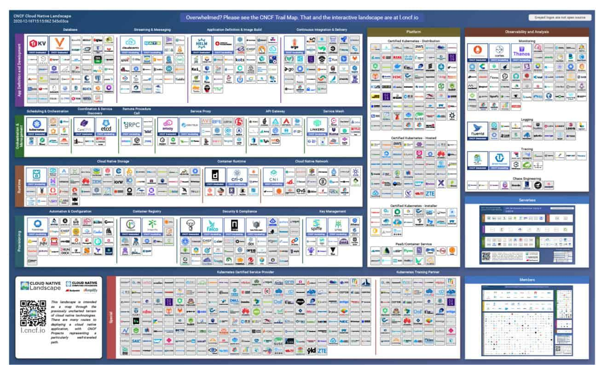

---
title: Containers
subtitle: what, how, which and when
theme: laas
author: Guilhem Saurel
date: 10/02/2022
mainfont: Source Serif 4
monofont: Source Code Pro
...


### This presentation

#### Available at

\centering

[`https://homepages.laas.fr/gsaurel/talks/
containers.pdf`](https://homepages.laas.fr/gsaurel/talks/containers.pdf)

#### Under License

\centering

{width=1cm}
{width=1cm}
{width=1cm}

<https://creativecommons.org/licenses/by-sa/4.0/>

### This presentation (continued)

#### Source

\centering

[`https://gitlab.laas.fr/gsaurel/talks :
containers.md`](https://gitlab.laas.fr/gsaurel/talks/-/blob/main/containers.md)

#### Discussions

\centering

<!-- \href doesn't like #, so let's directly use \url -->
\url{https://im.laas.fr/\#/room/\#containers:laas.fr}

### Outline

\setcounter{tocdepth}{1}
\tableofcontents

# Concepts

## Filesystem

### Image

- A read-only tar of the filesystem

. . .

- Metadata
    - ID, Checksum, Size
    - Author, creation date
    - Environment variables
    - Working directory, User
    - Architecture, OS
    - Entrypoint and/or default command
    - History

### Layers


### Internals

```bash
$ docker pull ubuntu:20.04
$ docker save ubuntu:20.04 | tar x
$ cat 54c9d8*.json | jq .history
```

```json
[
  {
    "created": "2022-02-02T02:14:45.667699167Z",
    "created_by": "ADD file:3ccf74… in / "
  },
  {
    "created": "2022-02-02T02:14:46.177066251Z",
    "created_by": "CMD [\"bash\"]",
    "empty_layer": true
  }
]
```

### History

```bash
$ docker history ubuntu:20.04
IMAGE          CREATED      CREATED BY         SIZE
54c9d81cbb44   6 days ago   CMD ["bash"]       0B
<missing>      6 days ago   ADD file:3ccf74…   72.8MB
```

### Copy on Write

```bash
$ docker inspect ubuntu:20.04 | jq .[0].Size
$ docker run --rm -it ubuntu:20.04 du -sxB1 /
```

. . .

Image          docker inspect  docker run
------------- --------------- -----------
ubuntu:20.04         72775208    81620992

### Copy on Write (Continued)

```Dockerfile
FROM ubuntu:20.04
RUN rm -rf /usr/share/doc
```

. . .

Image          docker inspect  docker run
------------- --------------- -----------
ubuntu:20.04         72775208    81620992
custom               72775208    80019456

### From the host

```bash
$ mount
[…]
overlay on /var/lib/docker/overlay2/eeaff…/merged …
```
. . .
```bash
$ sudo ls /var/lib/docker/overlay2/eeaff*/merged
bin   etc   lib32   media  proc  sbin  tmp
boot  home  lib64   mnt    root  srv   usr
dev   lib   libx32  opt    run   sys   var
```

## Network

### Container side

```bash
$ docker run --rm -it ubuntu:20.04
root@a4c1089933e0:/# apt update && apt install iproute2
[…]
root@a4c1089933e0:/# ip address
1: lo: <LOOPBACK,UP,LOWER_UP> mtu 65536 qdisc noqueue
    link/loopback 00:00:00:00:00:00 brd 00:00:00:00:00
    inet 127.0.0.1/8 scope host lo
359: eth0@if360: <BROADCAST,MULTICAST,UP,LOWER_UP> mtu
    link/ether 02:42:ac:11:00:02 brd ff:ff:ff:ff:ff:ff
    inet 172.17.0.2/16 brd 172.17.255.255 scope global
```

### Host side

```bash
359: eth0@if360: <BROADCAST,MULTICAST,UP,LOWER_UP> mtu
    link/ether 02:42:ac:11:00:02 brd ff:ff:ff:ff:ff:ff
    inet 172.17.0.2/16 brd 172.17.255.255 scope global
```
. . .
```bash
$ ip address show docker0
[…]
4: docker0: <BROADCAST,MULTICAST,UP,LOWER_UP> mtu 1500
    link/ether 02:42:19:c7:ea:42 brd ff:ff:ff:ff:ff:ff
    inet 172.17.0.1/16 brd 172.17.255.255 scope global
    inet6 fe80::42:19ff:fec7:ea42/64 scope link
360: veth80c16b5@if359: <BROADCAST,MULTICAST,UP,LOWER_UP>
    link/ether de:9b:10:58:45:70 brd ff:ff:ff:ff:ff:ff
    inet6 fe80::dc9b:10ff:fe58:4570/64 scope link
```

### Network Namespaces

```bash
$ pid=$(docker inspect -f '{{.State.Pid}}' $cont)
$ sudo mkdir -p /var/run/netns/
$ sudo ln -sT /proc/$pid/ns/net /var/run/netns/$cont
$ sudo ip netns exec "$cont" ip address
1: lo: <LOOPBACK,UP,LOWER_UP> mtu 65536 qdisc noqueue
    link/loopback 00:00:00:00:00:00 brd 00:00:00:00:00
    inet 127.0.0.1/8 scope host lo
359: eth0@if360: <BROADCAST,MULTICAST,UP,LOWER_UP> mtu
    link/ether 02:42:ac:11:00:02 brd ff:ff:ff:ff:ff:ff
    inet 172.17.0.2/16 brd 172.17.255.255 scope global
```


### Network drivers

- `bridge`: default, with NAT
- `host`: remove isolation
- `none`: remove network
- `ipvlan`, `macvlan`: advanced use cases

## Other isolations

### ENV

```bash
$ docker run --rm -it ubuntu:20.04 env
PATH=/usr/local/sbin:/usr/local/bin:/usr/sbin:/usr/bin:/sbin:/bin
HOSTNAME=14e30a0c1bc7
TERM=xterm
HOME=/root
```

### Cgroups

```bash
$ docker run --rm -it ubuntu:20.04
root@a4c1089933e0:/# apt update && apt install stress
[…]
root@a4c1089933e0:/# stress --cpu 3
```

. . .

```bash
$ top
 PID UTIL PR NI VIRT RES SHR S  %CPU %MEM  TEMPS+ COM.
3694 root 20  0 3856 100   0 R 100,0  0,0 1:52.95 stress
3692 root 20  0 3856 100   0 R  99,7  0,0 1:52.94 stress
3693 root 20  0 3856 100   0 R  99,7  0,0 1:52.94 stress
[…]
```

## Performances

### Performances

- processes, CPU, RAM: native

. . .

- network: NAT by default / native with `host`

. . .

- filesystem: CoW, bind mounts

. . .

- size: ubuntu: 72M, debian: 12M, alpine: 5M

. . .

- isolation: namespaces

# Usage

## Run a container

### Hello World

```bash
$ docker run --rm -it hello-world
Unable to find image 'hello-world:latest' locally
latest: Pulling from library/hello-world
2db29710123e: Pull complete
Digest: sha256:97a379f4f88575512824f3b352bc03cd75e23917…
Status: Downloaded newer image for hello-world:latest

Hello from Docker!
[…]
```

### Where is my work ?

```bash
$ docker run -it my-project
root@ad2955960ee7:/# vim my-script.sh
root@ad2955960ee7:/# exit
$ docker run -it my-project bash ./my-script.sh
```
. . .
```bash
bash: ./my-script.sh: No such file or directory
```

### How you could find your work back…

```bash
$ docker ps
CONTAINER ID IMAGE      COMMAND CREATED        STATUS
$ docker ps -a
CONTAINER ID IMAGE      COMMAND CREATED        STATUS
ad2955960ee7 my-project "bash"  15 seconds ago Exited
$ docker start ad2955960ee7
ad2955960ee7
$ docker ps
CONTAINER ID IMAGE      COMMAND CREATED        STATUS
ad2955960ee7 my-project "bash"  42 seconds ago Up 4 sec…
$ docker attach ad2955960ee7
root@ad2955960ee7:/# bash ./my-script.sh
Hi ! ./my-script.sh is starting...
```

### Volumes

```bash
$ docker volume create my-workspace
my-workspace
$ docker run --rm -it -v my-workspace:/ws ubuntu:20.04
root@1ab7b3188c76:/# ls /ws
root@1ab7b3188c76:/# touch /ws/hello
root@1ab7b3188c76:/# exit
$ docker run --rm -it -v my-workspace:/ws ubuntu:20.04
root@0994f95db805:/# ls /ws
hello
```

### Bind Mounts

```bash
$ docker run --rm -it -v ~/my-ws:/ws ubuntu:20.04
root@1ab7b3188c76:/# ls /ws
Dockerfile  README.md  requirements.txt  script.py
root@1ab7b3188c76:/# touch /ws/hi
root@1ab7b3188c76:/# exit
$ ls ~/my-ws
Dockerfile  hi  README.md  requirements.txt  script.py
```

### Other run arguments

#### Name
```bash
$ docker run --rm -it --name my-container ubuntu:20.04
```
. . .

#### Network
```bash
$ docker run --rm -it -p 8000:8000 ubuntu:20.04
$ docker run --rm -it --net host ubuntu:20.04
```
. . .

#### Detach
```bash
$ docker run --rm -it -d ubuntu:20.04
```
. . .

#### Ressources
```bash
$ docker run --rm -it --cpus 2 ubuntu:20.04
$ docker run --rm -it --gpus all ubuntu:20.04
```

### Share images

#### Tag

```bash
docker tag my-project \
    gitlab.laas.fr:4567/my-name/my-project
```
. . .

#### Push

```bash
docker push gitlab.laas.fr:4567/my-name/my-project
```
. . .

#### Pull

```bash
docker pull gitlab.laas.fr:4567/my-name/my-project
```
. . .

NB: <https://hub.docker.com> by default

## Build an image

### Dockerfile

```bash
$ cat Dockerfile
```

```Dockerfile
FROM python:3.10
WORKDIR /app
ADD requirements.txt .
RUN python -m pip install -r requirements.txt
ADD . .
CMD ./manage.py test
ENV PYTHONUNBUFFERED=1
```

. . .

```bash
$ docker build -t my-app .
```

. . .

NB: Build context

### Commit

```bash
$ docker run --rm -it ubuntu:20.04
root@40e14372a5b9:/# apt update
root@40e14372a5b9:/# apt install python3-pip
root@40e14372a5b9:/# pip install django numpy
root@40e14372a5b9:/# vim script.py
```

```bash
$ docker commit 42491f28c1f6 my-app
```

## Tips

### Buildkit

```bash
$ export DOCKER_BUILDKIT=1
```
. . .
```Dockerfile
FROM python:3.10
RUN --mount=type=cache,target=/var/cache/apt \
    --mount=type=cache,target=/var/lib/apt \
    --mount=type=cache,target=/root/.cache \
    apt-get update -y && apt-get install -qqy \
    gcc \
    libpq-dev \
 && python -m pip install -U pip \
 && python -m pip install \
    psycopg2 \
 && apt-get autoremove -qqy gcc
```

### Dockerignore

```bash
$ echo 'build' >> .dockerignore
$ echo '*.tar.gz' >> .dockerignore
```

### Prune

```bash
$ docker system prune
```

. . .

```bash
$ docker system prune -a --volumes
```

### Compose file

```bash
$ cat docker-compose.yml
```

```yaml
version: "3"
services:
  worker:
    build: .
    volumes:
      - .:/code
      - worker-vol:/data
  cache:
    image: redis
volumes:
  worker-vol: {}
```

### Compose usage

```bash
$ docker compose up -d
$ docker compose logs
$ docker compose down
```

# Container platforms

### Cloud Native Computing Foundation

<https://cncf.io>



### Podman

- Daemonless container engine
- Root is not required

. . .

```bash
$ alias docker=podman
```

### Singularity / Apptainer

- Secure container platform
- Made for use on HPC / large clusters
- Use Singularity files (`.sif`)

. . .
```bash
$ singularity pull docker://ubuntu:20.04
$ singularity shell ubuntu_20.04.sif
Singularity> whoami
gsaurel
Singularity> pwd
/home/gsaurel/talks
Singularity> ls
Dockerfile  Makefile  README.md  containers.md	containers.pdf
```

### Singularity / Apptainer Definition Files

```
Bootstrap: docker
From: python:3.10

%post
    apt-get update
    apt-get -qy install gcc libpq-dev
    python -m pip install psycopg2

%environment
    export PYTHONUNBUFFERED=1

%runscript
    ./manage.py test
```

```bash
$ singularity build my-container.sif my-container.def
```

# Use cases

### Reproducible environment

- continuous integration
- complex dependency setup
- software debugging

. . .

- reproducible science

### Production

- HPC
- host web services
- run single statically linked binary with metadata

### Questions ?

Thanks for your time :)
