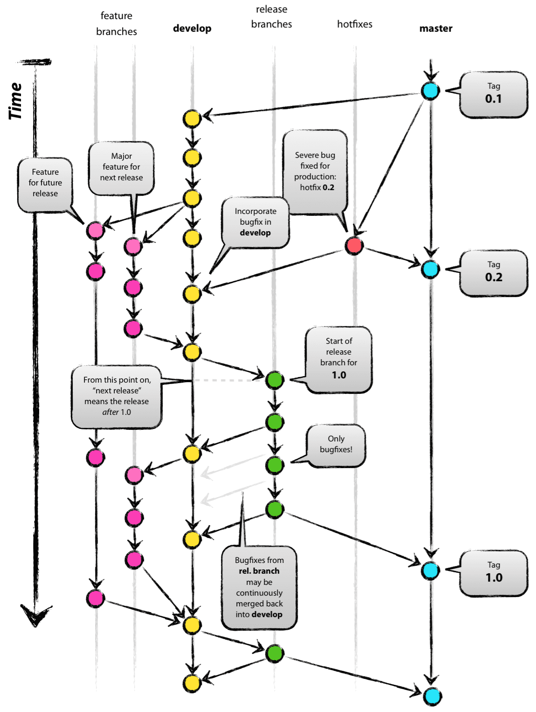
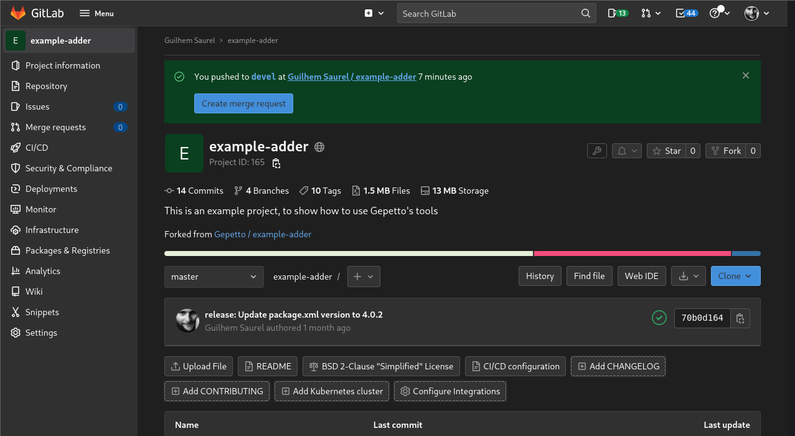
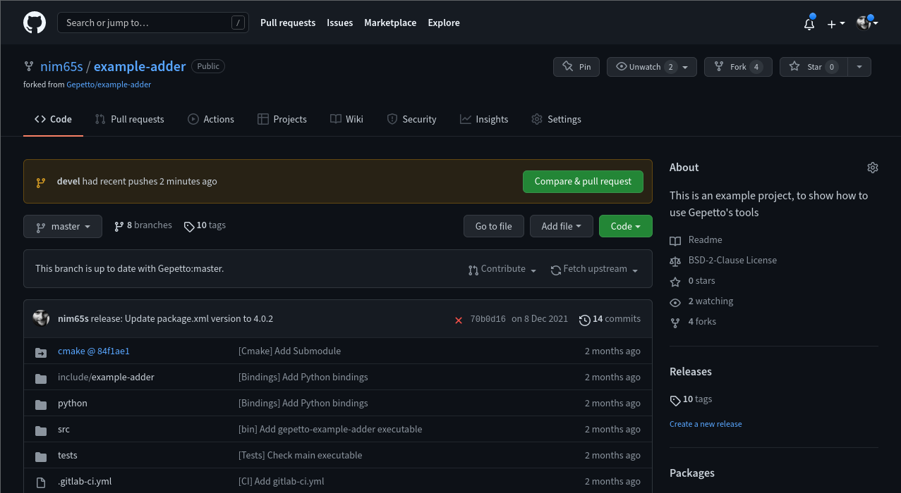

---
title: "Git: Forges"
subtitle: Issues, Branches, Forks, Requests, CI, and Workflows
theme: laas
author: Guilhem Saurel
date: 25/01/2022
mainfont: Source Serif 4
monofont: Source Code Pro
...

## This presentation

### Available at

\centering

[`https://homepages.laas.fr/gsaurel/talks/
git-forges.pdf`](https://homepages.laas.fr/gsaurel/talks/git-forges.pdf)

### Under License

\centering

{width=1cm}
{width=1cm}
{width=1cm}

<https://creativecommons.org/licenses/by-sa/4.0/>

## This presentation (continued)

### Source

\centering

[`https://gitlab.laas.fr/gsaurel/talks :
git-forges.md`](https://gitlab.laas.fr/gsaurel/talks/-/blob/main/git-forges.md)

### Discussions

\centering

<!-- \href doesn't like #, so let's directly use \url -->
\url{https://im.laas.fr/\#/room/\#git-forges:laas.fr}

## Outline

\tableofcontents

# Introduction

## What are software forges

- Software management
    - git repository (web, HTTPS, SSH)
    - authorizations
    - issue tracker

## Hierarchy

1. domain
2. username *OR* group (organization)
3. project


- `https:// gitlab.laas.fr / gsaurel / talks`
- `https:// github.com / gepetto / example-adder`


## Issues

- bug fix / feature request
- Github / Gitlab: `#4`
- referencable from git:
    - `git commit -m "add test for user input, ref #4"`
    - `git commit -m "sanitize user input, fix #4"`

# Branches

## Goal



## Usual branches

- default: `master` or `main`
- `devel`, `stable`
- `issue/5`
- `topic/something`

# Forks

## 2 types of fork

- scission (software development)
    - document motivations
    - rename
    - change logo / website etc.
    - ensure compatibility
- collaboration (git forges)
    - try to keep synchronized


## 2 types of fork

- scission (software development)
    - document motivations
    - rename
    - change logo / website etc.
    - ensure compatibility
- **collaboration (git forges)**
    - try to keep synchronized

## Work locally with multiple forks

```
git clone --recursive \
        git@gitlab.laas.fr:gsaurel/example-adder.git
cd example-adder
git remote add gepetto \
        git@gitlab.laas.fr:gepetto/example-adder.git
```

. . .

```
git pull gepetto master
git push origin master
```

## SSH shortcut

```ini
# ~/.ssh/config
Host gl
    HostName gitlab.laas.fr
    User git
```

```
git clone --recursive gl:gsaurel/example-adder
```

# Requests

## Gitlab



## Gitlab from command line

```
git push -o merge_request.create \
         -o merge_request.target=devel \
         origin topic/something
```

## Github



## Github from command line

Required: https://cli.github.com/

```
gh pr create
```

# CI

## Gitlab

```yml
# .gitlab-ci.yml
image: gitlab.laas.fr:4567/gsaurel/talks

build:
  script:
    - make

test:
  script:
    - make test
```

## Gitlab shortcut

```
git config --global alias.mwps "push \
        -o merge_request.create \
        -o merge_request.target=devel \
        -o merge_request.merge_when_pipeline_succeeds \
        -o merge_request.remove_source_branch"
```

```
git mwps origin topic/something
```

## Github

```yml
# .github/workflows/build.yml
name: Build
on: [push,pull_request]

jobs:
  build:
    name: Transpile markdown sources into PDF
    runs-on: nim65s/talks
    steps:
      - uses: actions/checkout@v2
      - run: make
```

# Workflows

## Example


# End notes

## References

https://learngitbranching.js.org/
https://nvie.com/posts/a-successful-git-branching-model/
https://docs.github.com/en/get-started/quickstart/github-flow

## Questions ?

Thanks for your time :)
