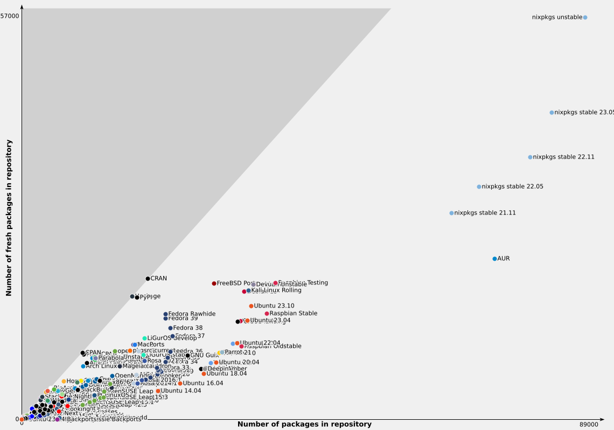

## Cette présentation

### Disponible à

\centering

[`https://homepages.laas.fr/gsaurel/talks/
home-manager.pdf`](https://homepages.laas.fr/gsaurel/talks/home-manager.pdf)

### Source

\centering

[`https://gitlab.laas.fr/gsaurel/talks :
home-manager.md`](https://gitlab.laas.fr/gsaurel/talks/-/blob/main/home-manager.md)

### Sous license

\centering

{width=1cm}
{width=1cm}
{width=1cm}

<https://creativecommons.org/licenses/by-sa/4.0/>

# Nix (gestionnaire de paquets)

## Démo

Utilisons un paquet !

## Store

```bash
/nix/store/7jxy9m61jh5br3kcc1vmix5lqyyixln2-vlc-3.0.20
├── bin/
│   ├── […]
│   ├── vlc
│   └── vlc-wrapper
├── include/
│   └── vlc/
│       ├── deprecated.h
│       ├── libvlc.h
[…]
├── lib/
│   ├── libvlc.so ⇒ libvlc.so.5.6.1
│   ├── libvlc.so.5.6.1
[…]
```

# Nix (langage)

## Nix


- domain-specific
- declarative
- pure
- functional

. . .

to launch bash commands


# Nixpkgs

## Un dépôt git

<https://github.com/NixOS/nixpkgs/>

. . .

avec 88 678 projets

## Repology



## Géré par la communauté

```diff
--- pkgs/development/python-modules/eigenpy/default.nix
+++ pkgs/development/python-modules/eigenpy/default.nix
@@ -10,14 +10,14 @@
 stdenv.mkDerivation (finalAttrs: {
   pname = "eigenpy";
-  version = "3.1.2";
+  version = "3.1.3";

   src = fetchFromGitHub {
     owner = "stack-of-tasks";
     repo = finalAttrs.pname;
     rev = "v${finalAttrs.version}";
     fetchSubmodules = true;
-    hash = "sha256-U2EXh6Foz/TH+vSrimrn2hDPTA++GLFLM7vnMXdq+rc=";
+    hash = "sha256-8UuJA96pkXXRKDzQTjoz7w8TQrS5+nfLdsT0j9/oqz0=";
   };
```

# NixOS

## `configuration.nix`

```nix
{ config, pkgs, ... }: {
  imports = [ ./hardware-configuration.nix ];
  environment.systemPackages = [
   pkgs.firefox
   pkgs.git
   pkgs.vim
   pkgs.wget
  ];
  networking.hostName = "exampleos";
  networking.networkmanager.enable = true;
  time.timeZone = "Europe/Paris";
  sound.enable = true;
  users.users.nim = {
    shell = pkgs.fish;
    isNormalUser = true;
    description = "Guilhem Saurel";
```

## Des liens symboliques

```bash
$ file /bin/sh
/bin/sh: symbolic link to /nix/store/kxkdrxvc3da2d…\
    -bash-interactive-5.2-p15/bin/bash
$ file /usr/bin/env
/usr/bin/env: symbolic link to /nix/store/j4fwy5gi…\
    -coreutils-9.1/bin/env
$ file /etc/passwd
/etc/passwd: symbolic link to /nix/store/6ilgn50da…\
    -base-system/etc/passwd
```

## Avantages

- fully declarative

. . .

- atomic upgrades

. . .

- rollbacks

. . .

- community

## Inconvénients

- ça change

. . .

- le wiki pas aussi bon qu’Arch

# Home manager

## Un dépôt git

<https://github.com/nix-community/home-manager>

## `home.nix`

```nix
{ config, pkgs, ... }:
{
  home.packages = [
    pkgs.htop
    pkgs.fortune
  ];

  programs.vim = {
    enable = true;
    defaultEditor = true;
    plugins = [ pkgs.vimPlugins.ale ];
    settings.tabstop = 8;
  };
}
```

## `home.nix` (suite)

```nix
{ config, pkgs, ... }:
{
  home.file = {
    ".config/dfc/dfcrc".source = ../dfc/dfcrc;
    ".xinitrc".text = "exec i3";
  };

  home.sessionVariables = {
    SHELL = "${pkgs.fish}/bin/fish";
  };
}
```

# Environnement de développement

## `shell.nix`

```nix
{ pkgs ? import <nixpkgs> {} }:
pkgs.mkShell {
  nativeBuildInputs = [
    pkgs.rustc
    pkgs.cargo
    pkgs.gcc
    pkgs.rustfmt
    pkgs.clippy
  ];
}
```

### Puis

```bash
$ nix-shell
```

## Questions ?

Merci de votre attention !
